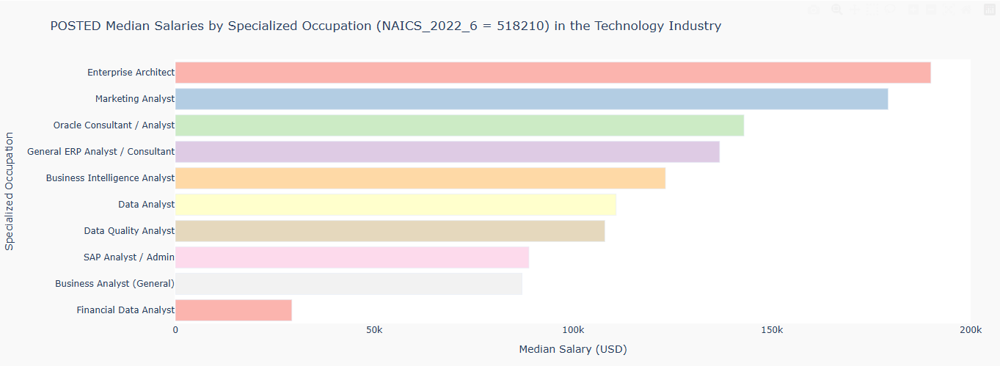
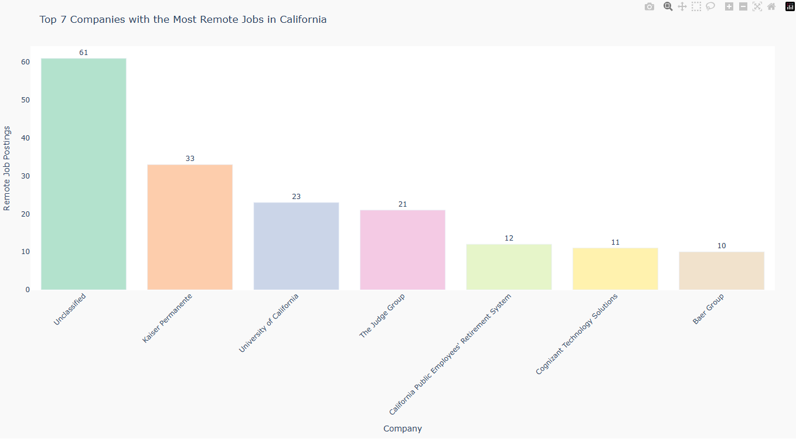
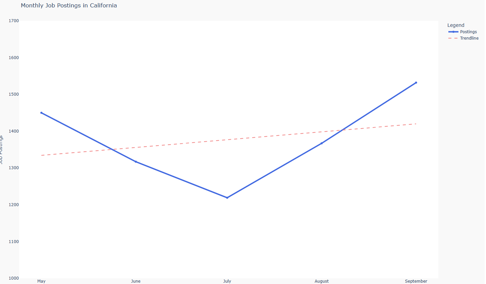
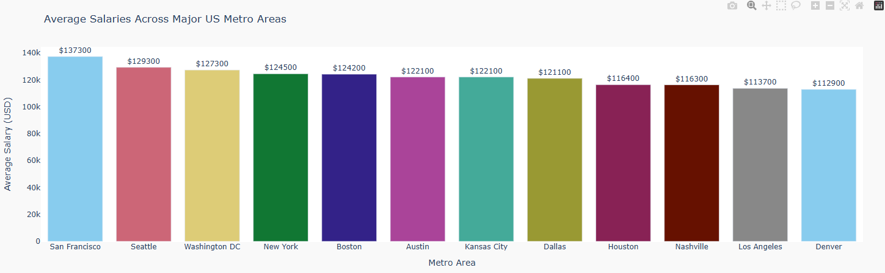

___

# STOPAS Assignment 02
___

Median Salaries by Occupation within the Technology Category

[🔗 Download interactive version](plots/fig_01_salary_by_occupation.html)

---

Top Hiring Companies in California for Remote Positions

[🔗 Download interactive version](plots/fig_02_remote_jobs_ca.html)

---

Recent Monthly Job Postings in the State of California

[🔗 Download interactive version](plots/fig_03_monthly_trends_ca.html)

---

Salary Comparison Across Major U.S. Cities

[🔗 Download interactive version](plots/fig_04_salary_by_city.html)

___

Check out a live version of the Notebook here: 

